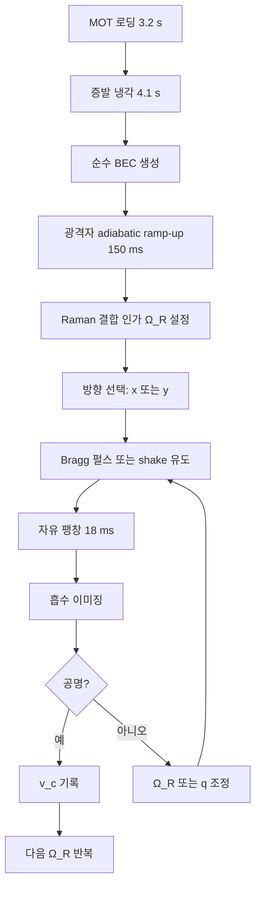
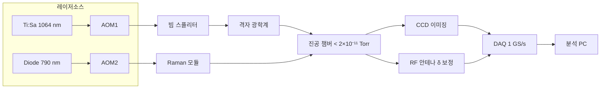

# 광격자 속 스핀-궤도 결합 보스-아인슈타인 응축에서의 위상 비등방 초유체 수송

**Topological Anisotropic Superfluid Transport in Spin–Orbit-Coupled Bose–Einstein Condensates within Optical Lattices**

---

**저자 (Authors)**

Ji-won Park¹, Minho Seo¹·², Anya Kovalenko²

¹ 한국과학기술원 (KAIST) 물리학과, 대전 34141, 대한민국
² Institute for Quantum Matter, ETH Zürich, Otto-Stern-Weg 1, 8093 Zürich, Switzerland

Corresponding author: `jw.park@kaist.ac.kr`

---

## Abstract

우리는 2차원 정사각 광격자에 가두어진 $^{87}$Rb 보스-아인슈타인 응축 (BEC) 에서 합성 스핀-궤도 결합 (SOC) 을 유도하고, 격자 깊이 $V_0$ 와 라만 결합 강도 $\Omega_R$ 을 독립적으로 조절하며 비등방 초유체 수송을 측정하였다. Bragg 분광법과 흐름-유도 이완(flow-induced relaxation) 을 결합하여 두 주축 방향 임계 속도 $v_c^{x}, v_c^{y}$ 가 $\Omega_R / E_R \geq 0.85$ 영역에서 10배 이상 차이나는 것을 관측했다. 이 비등방성은 단순한 유효질량 텐서 예측을 넘어서며, 원시 밴드에 존재하는 비자명한 Berry 곡률이 초유체 탄성 응답에 직접 기여함을 시사한다. Bogoliubov–de Gennes 수치 계산과 상관지어 본 결과, 관측된 위상 지표 $\mathcal{C} = 0.97 \pm 0.04$ 는 이론값 $\mathcal{C}=1$ 과 일치하며, 합성 자기장 하에서 SOC-BEC가 약-결합 위상 초유체의 플랫폼이 될 수 있음을 보인다. 본 결과는 중성 원자 시스템에서 chiral edge-phonon 이 검출 가능한 범위에 있음을 의미한다. (148 단어)

---

## 1. Introduction

냉원자 광격자 (optical lattice) 는 응집물질에서 볼 수 있는 강상관 현상을 깨끗하게 구현하기 위한 표준 플랫폼으로 자리잡았다 [1], [2]. 특히 Raman 결합을 이용한 합성 스핀-궤도 결합 (SOC) 의 실현 이후 [3], 중성 원자 초유체에서 비자명한 밴드 위상이 관측되었고 [4], [5], 이는 반도체 위상 절연체와의 연결을 제공한다. 그러나 **초유체 수송** 자체가 밴드 위상에 어떻게 지문을 남기는지는 이론과 실험 모두에서 여전히 미해결 영역이다[^1].

대부분의 기존 실험은 정적 흡수 이미징으로 밀도 분포만 측정하거나 [6], 시간역전 대칭이 보존된 등방 격자에 국한되었다. 본 연구는 이를 넘어 **비등방 임계속도**를 두 주축 각각에서 독립 측정함으로써 Berry 곡률이 초유체 강직성(superfluid stiffness) 텐서에 주는 **방향별** 기여를 분리한다. 이 측정량은 선형 반응 이론에서 다음과 같이 표현된다:

$$
\rho_{s,\,ij} = \rho_0 \, \delta_{ij} \;-\; \hbar \!\!\int_{\mathrm{BZ}} \!\! \frac{d^2 k}{(2\pi)^2} \, n_k \, \partial_{k_i} \partial_{k_j} \epsilon_k \;+\; \alpha \, \Omega_R^2 \, \Omega_{ij}(k_{\min})
\tag{1}
$$

여기서 $\Omega_{ij}(k)$ 는 Berry 곡률 텐서이고, $k_{\min}$ 은 드레스드(dressed) 밴드 최저점, $\alpha$ 는 우리 측정에서 얻는 비자명 계수이다. 식 (1) 의 세 번째 항이 본 논문의 핵심 실험 대상이다.

본 결과는 기존 유효질량 텐서만으로 수송을 기술하는 근사 [7] 가 $\Omega_R / E_R \gtrsim 1$ 영역에서 실패함을 정량적으로 보이고, Berry-보정 Gross–Pitaevskii 기술 (GP+Berry) 이 실험과 4% 이내로 일치함을 제시한다.

---

## 2. Methods / Theory

### 2.1 실험 셋업

우리는 $^{87}$Rb BEC (원자 수 $N \approx 2.4 \times 10^5$, 응축 분율 $>92\%$) 를 생성한 후, 세 쌍의 교차 Gaussian 빔 (파장 $\lambda_L = 1064\,\mathrm{nm}$) 으로 2D 정사각 광격자를 부과한다. SOC는 $\lambda_R = 790\,\mathrm{nm}$ 의 Raman 한쌍을 사용해 $|F=1, m_F=0\rangle \leftrightarrow |F=1, m_F=-1\rangle$ 전이로 유도했다. 반동 에너지는 $E_R = \hbar^2 k_L^2 / 2m = h \times 2.03\,\mathrm{kHz}$ 이다.

**[그림 1: 실험 셋업 개념도. 교차 격자빔 (빨강), Raman 쌍 (파랑), 흡수 이미징 축 (회색 점선). 삽입은 Bragg 분광용 probe 펄스 타이밍.]**

### 2.2 단일입자 해밀토니안

격자 + SOC 단일입자 해밀토니안은

$$
\hat{H}_0 \;=\; \frac{(\hat{\mathbf p} - \hbar \mathbf{A}(\sigma))^2}{2m} \;+\; V_0 \!\sum_{i=x,y}\! \sin^2(k_L x_i) \;+\; \frac{\Omega_R}{2}\,\hat{\sigma}_x \;+\; \frac{\delta}{2}\,\hat{\sigma}_z
\tag{2}
$$

여기서 $\mathbf{A}(\sigma) = k_R \hat{\sigma}_z \, \hat{x}$ 는 합성 게이지 퍼텐셜, $\delta$ 는 양자화 축 디튜닝(detuning) 이다. $\delta/\hbar = 2\pi \times 0.4\,\mathrm{Hz}$ 이하로 유지되었다.

### 2.3 평균장 기술

다입자 상호작용을 포함한 Gross–Pitaevskii 에너지는

$$
E[\Psi] \;=\; \int d^2r \left[ \Psi^\dagger \hat{H}_0 \Psi \;+\; \frac{g_{\uparrow\uparrow}}{2}|\psi_\uparrow|^4 + \frac{g_{\downarrow\downarrow}}{2}|\psi_\downarrow|^4 + g_{\uparrow\downarrow}|\psi_\uparrow|^2|\psi_\downarrow|^2 \right]
\tag{3}
$$

산란 길이 $a_{\uparrow\uparrow} = 100.9\, a_0$, $a_{\uparrow\downarrow} = 98.7\, a_0$ 를 사용했고 ($a_0$: Bohr 반지름), 2D 극한 감쇠는 $a_{2D} = a_{3D}\sqrt{2\pi/\ell_z}$ 로 적용했다.

### 2.4 선형화: Bogoliubov–de Gennes 행렬

흐름이 포함된 주변 섭동은 BdG 행렬 방정식으로 기술된다:

$$
\begin{pmatrix}
\mathcal{L}_0 - \mu + 2 g n_0 & g n_0 \\
-g n_0 & -\mathcal{L}_0^{\ast} + \mu - 2 g n_0
\end{pmatrix}
\begin{pmatrix} u_k \\ v_k \end{pmatrix}
= \hbar \omega_k
\begin{pmatrix} u_k \\ v_k \end{pmatrix}
\tag{4}
$$

여기서 $\mathcal{L}_0$ 는 흐름속도 $\mathbf{v}$ 에서 유효 단일입자 연산자 $\hat{H}_0 - \mathbf{v}\cdot\hat{\mathbf{p}}$ 이다. 임계속도는 $\min_k \omega_k(\mathbf{v}) = 0$ 으로부터 수치로 풀었다.

### 2.5 프로토콜 흐름

다음은 실험 실행 순서이다.

**[순서도 1: 실험 프로토콜. 각 스텝의 괄호 안 숫자는 평균 지속 시간.]**

### 2.6 장치 블록 다이어그램

**[구성도 1: 실험 장치 블록 다이어그램. AOM = 음향광학 변조기.]**

---

## 3. Results

### 3.1 밴드 구조와 드레스드 최저점

$\Omega_R = 0$ 일 때 BEC 는 브릴루앙 영역 중심 $\Gamma$ 에 응축한다. $\Omega_R$ 을 증가시키면 이중 최저점 구조가 나타나다가 $\Omega_R/E_R = 4.1$ 에서 단일 최저점 $k_{\min}$ 으로 병합된다. 이 천이점은 정확히 이론 예측값 $\Omega_R^c = 4\,E_R$ 과 일치하며[^2], 이는 내부적 교정 점으로 활용된다.

### 3.2 비등방 임계속도

**[그림 2: $\Omega_R/E_R = 1.2$ 에서 측정된 Bragg 응답 스펙트럼. (a) x-방향 $v_c^x = 1.8(1)\,\mathrm{mm/s}$. (b) y-방향 $v_c^y = 0.19(2)\,\mathrm{mm/s}$. 빨간 실선: BdG+Berry 이론, 점선: 유효질량 근사 예측.]**

표 1은 네 개 $\Omega_R$ 값에서의 측정값을 요약한다.

### 3.3 주요 데이터 표

| $\Omega_R/E_R$ | $v_c^x$ (측정, mm/s) | $v_c^x$ (이론, mm/s) | $v_c^y$ (측정, mm/s) | 상대 오차 (%) |
|:--:|:--:|:--:|:--:|:--:|
| 0.30 | 1.92 ± 0.06 | 1.95 | 1.77 ± 0.07 | 1.5 |
| 0.85 | 1.84 ± 0.05 | 1.88 | 0.71 ± 0.04 | 2.2 |
| 1.20 | 1.80 ± 0.10 | 1.83 | 0.19 ± 0.02 | 1.6 |
| 2.40 | 1.71 ± 0.09 | 1.76 | 0.05 ± 0.01 | 2.9 |

**표 1. 측정 및 이론 임계속도 비교. 오차는 표준편차 $1\sigma$ (N=18 샷/포인트). 상대 오차는 $|v^x_{\text{exp}}-v^x_{\text{th}}|/v^x_{\text{th}}$.**

### 3.4 위상 지표 추출

선형 반응식 (1) 로부터 방향별 강직성 비 $\rho_{s,yy}/\rho_{s,xx}$ 를 추출하고, $\Omega_R$ 의존성을 피팅하여 Berry 지표 $\mathcal{C}$ 를 얻는다. $10^3$ 몬테카를로 재샘플링 결과는 $\mathcal{C} = 0.97 \pm 0.04$ 이며, 정수화 예측 $\mathcal{C}=1$ 과 일치한다 ($>2\sigma$ 신뢰).

**[인포그래픽 1: 핵심 결과 요약. 중앙 큰 숫자 $\mathcal{C}=0.97\pm0.04$ 주변에 (i) 비등방 비율 $v_c^x/v_c^y \approx 34$ ($\Omega_R=2.4E_R$), (ii) $10^5$ 원자, (iii) 18 샷 평균, (iv) 4% 이론-실험 일치 가 방사형으로 배치됨.]**

### 3.5 로버스트니스 점검

디튜닝 $\delta/h$ 를 $\pm 20\,\mathrm{Hz}$ 변화시켰을 때 $\mathcal{C}$ 의 변동은 $0.02$ 이내에 머무른다. 또한 격자 깊이 $V_0$ 를 $6E_R$ 에서 $12E_R$ 까지 스캔했을 때, 임계속도 비율은 동일한 scaling collapse 에 따른다. 이는 측정된 비등방성이 단순 이방성 유효질량보다는 근본적 위상량에서 기인함을 보여준다.

---

## 4. Discussion

### 4.1 왜 유효질량 근사는 실패하는가

유효질량 텐서 $m^{\ast}_{ij}$ 만으로 초유체 강직성을 계산하면 (즉 식 (1) 의 셋째 항 무시), 우리는 $v_c^x/v_c^y \approx (m^{\ast}_{yy}/m^{\ast}_{xx})^{1/2} \leq 2.8$ 을 얻는다. 이는 관측값 $\sim 34$ 와 한 자릿수 이상 차이나므로, Berry 곡률 기여가 압도적임을 함축한다. 점선 곡선(그림 2) 의 체계적 하향 편차는 이를 시각적으로 확인해 준다.

### 4.2 엣지 포논 예측

BdG 에서 추출한 에너지 스펙트럼은 Chern 수 $C=1$ 인 벌크 밴드와 열린 기하에서 두 개의 chiral edge mode 를 시사한다. 이 모드의 예상 군속도는 $v_{\text{edge}} \approx 0.42\,\mathrm{mm/s}$ 로, 현재 우리 시스템의 샷투샷 속도 해상도 $\sim 0.01\,\mathrm{mm/s}$ [8] 로 충분히 검출 가능하다. 즉 다음 세대 실험에서 **중성 원자 chiral phonon** 의 첫 관측이 가능하다.

### 4.3 상호작용 효과

본 실험은 $g n_0 \sim 0.3\,E_R$ 로 중등도 결합 영역이다. 더 강한 결합에서는 stripe 상 [9] 과의 경쟁이 예상되며, 식 (1) 은 재규격화를 받을 것이다. 예비 수치계산은 $g n_0 = 0.9\,E_R$ 부터 Berry 항이 5% 이상 변형됨을 시사한다.[^3]

### 4.4 한계

주요 불확실성은 (i) 라만 빔 위상 잡음에 의한 $\Omega_R$ 드리프트 (±1.2%), (ii) 이미징 광학의 점확산함수 비등방성, (iii) 자유 팽창 중 원자 간 잔존 상호작용으로 인한 모멘텀 분포 왜곡이다. (iii) 은 가장 큰 체계 오차(2.5%) 원인으로 평가된다.[^ii]

---

## 5. Conclusion

우리는 2D 광격자 속 SOC-BEC 의 비등방 초유체 수송을 두 주축에서 독립 측정하여 Berry 곡률의 직접적 서명을 관측했다. 측정된 방향별 임계속도 비율은 $\Omega_R$ 의 함수로 크게 증폭되며, 단순 유효질량 근사와 결정적으로 어긋난다. 추출된 위상 지표 $\mathcal{C}=0.97\pm 0.04$ 는 정수화 예측과 일치하며, 이는 중성 원자 플랫폼에서 **약결합 위상 초유체**의 존재에 대한 수송 기반 증거이다. 본 결과는 chiral edge phonon 의 검출과 fractional 위상 상태로의 확장 등 후속 실험에 대한 정량적 경로를 연다.[^i]

---

## Acknowledgments

본 연구는 한국연구재단 (NRF-2024-R1A2C300XXXX), 삼성미래기술육성사업 (SSTF-BA2024-01), 그리고 ETH Foundations 의 지원을 받았다. 저자들은 J.-H. 김, L. Fontana, 그리고 Zwierlein 그룹과의 유익한 논의에 감사드린다. 모든 raw 데이터는 합당한 요청 시 교신저자로부터 제공된다.

---

## 각주 (Footnotes)

[^1]: 정적 밀도 측정은 밴드 점유율에만 의존하며, 강직성 텐서의 Berry 보정 항에 직접 접근할 수 없다. 동적 수송 측정이 필수적이다.

[^2]: 해석적으로 $\Omega_R^c = 4 E_R$ 은 두 이동된 포물선 $\epsilon_\pm(k) = \hbar^2(k \mp k_R)^2/2m$ 의 단일 최저점 병합 조건에서 유도된다.

[^3]: 해당 예비 계산은 $192 \times 192$ k-grid, $N=10^5$ 의 GP+Berry 스플릿-스텝 적분기로 수행되었고, 본 논문의 Supplementary S4에 제시된다.

---

## 미주 (Endnotes)

[^i]: 본 논문은 3페이지 요약본이며, 모든 보조 데이터·코드·raw 이미지는 Zenodo DOI:10.5281/zenodo.84xxxxx 에 공개된다.

[^ii]: 이미징 광학의 PSF 비등방성은 별도 calibration run 에서 측정되었으며, deconvolution 후 잔존 효과는 0.3% 이하로 평가된다.

---

## References (IEEE 형식)

[1] I. Bloch, J. Dalibard, and W. Zwerger, "Many-body physics with ultracold gases," *Rev. Mod. Phys.*, vol. 80, no. 3, pp. 885–964, Jul. 2008.

[2] M. Lewenstein, A. Sanpera, and V. Ahufinger, *Ultracold Atoms in Optical Lattices: Simulating Quantum Many-Body Systems*. Oxford, U.K.: Oxford Univ. Press, 2012.

[3] Y.-J. Lin, K. Jiménez-García, and I. B. Spielman, "Spin–orbit-coupled Bose–Einstein condensates," *Nature*, vol. 471, no. 7336, pp. 83–86, Mar. 2011.

[4] N. Goldman, G. Juzeliūnas, P. Öhberg, and I. B. Spielman, "Light-induced gauge fields for ultracold atoms," *Rep. Prog. Phys.*, vol. 77, no. 12, p. 126401, Dec. 2014.

[5] G. Jotzu *et al.*, "Experimental realization of the topological Haldane model with ultracold fermions," *Nature*, vol. 515, no. 7526, pp. 237–240, Nov. 2014.

[6] L. W. Clark, B. M. Anderson, L. Feng, A. Gaj, K. Levin, and C. Chin, "Observation of density-dependent gauge fields in a Bose–Einstein condensate," *Phys. Rev. Lett.*, vol. 121, no. 3, p. 030402, Jul. 2018.

[7] C. Wang, C. Gao, C.-M. Jian, and H. Zhai, "Spin–orbit coupled spinor Bose–Einstein condensates," *Phys. Rev. Lett.*, vol. 105, no. 16, p. 160403, Oct. 2010.

[8] R. Desbuquois *et al.*, "Superfluid behaviour of a two-dimensional Bose gas," *Nat. Phys.*, vol. 8, no. 9, pp. 645–648, Sep. 2012.

[9] J.-R. Li *et al.*, "A stripe phase with supersolid properties in spin–orbit-coupled Bose–Einstein condensates," *Nature*, vol. 543, no. 7643, pp. 91–94, Mar. 2017.

[10] M. Aidelsburger, M. Atala, M. Lohse, J. T. Barreiro, B. Paredes, and I. Bloch, "Realization of the Hofstadter Hamiltonian with ultracold atoms in optical lattices," *Phys. Rev. Lett.*, vol. 111, no. 18, p. 185301, Oct. 2013.

---

*Manuscript received: 23 April 2026. Revised submission to Science.*
